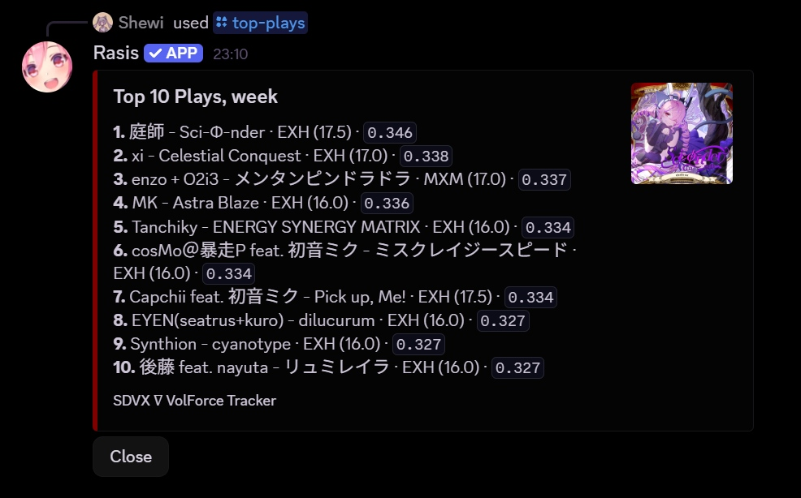

# SDVX ∇ VolForce Tracker

Very random script to track, send, and generate stats of plays in real time, for SOUND VOLTEX ∇, running on the RyuNET private network.  
They are sent in Discord DMs via a local bot.

The script observes the game's e-amusement result requests through a local proxy and forwards them unchanged to Ryu's server.

[Custom charts](https://x.ryu7w7.xyz/plugin/sdvx@asphyxia/custom%20charts%20setup) are supported.

<p>
	
</p>
<p>
	
</p>
<p>
	
</p>
<p>
	
</p>
<p>
	
</p>

## Requirements

- Python 3.10+
- NodeJS 22.5+

## Setup

- Download the ZIP of this repo under Code, unzip it, and place the main folder into your sdvx' game folder. It should look like:

```text
|-- SOUND VOLTEX NABLA/
	|-- data/
	...
	|-- prop/
	|-- screenshots/
	|-- SDVX7-VolForce-Tracker-main/
	...
	|-- spice64.exe
	|-- spicecfg.exe
```

- Create a [Discord app](https://discord.com/developers/applications).
- Under `Installation`, copy the install link, paste it anywhere in Discord, then click on it to user-install the app.
- Under `Bot`, enable Message Content Intent, generate a token and copy it.
- Run `setup.bat` and follow the instructions
- Set Spice2x's EA Service URL to `http://127.0.0.1:8080/service`
- Run `SDVX-∇-VolForce-Tracker.bat`, _then_ start the game. Create a shortcut of it for easy access !

## Limitations

- You cannot run the game without the proxy, as long as EA Service URL is set to localhost.
- Due to API limitations, the message is sent only after quitting the result page.
- Timing is estimated from the midpoints of the following 7 values histogram the game sends to the server, found in `soundvoltex.dll`. It does not match in-game's CRITICAL or NEAR judgements for some reasons:

|        | Window      | Midpoint |
| ------ | ----------- | -------- |
| h3     | ± 16.67 ms  | 0 ms     |
| h2, h4 | ± 33.33 ms  | ±25 ms   |
| h1, h5 | ± 41.67 ms  | ±37.5 ms |
| h0, h6 | ± 133.33 ms | ±87.5 ms |

Let $\forall i \in [1, 5] \cap \mathbb{Z}$ $h_i$ the number of notes in its respective hit window.

Thus:

$Timing = \frac{87.5(h_6-h_0) + 37.5(h_5-h_1) + 25(h_4-h_2)}{\sum_{i=0}^{6}h_i}$ ms.

However, $h_i$ includes laser notes (which are always S-CRITICALs or ERRORs), which makes $Timing$ way more precise than it should be. But when S-CRITICAL is enabled, the game sends BT/FX S-CRITICAL data. We can then compensate for that inflation in S-CRITICALs:

$Timing = \frac{87.5(h_6-h_0) + 37.5(h_5-h_1) + 25(h_4-h_2)}{\sum_{i=0}^{6}h_i - h_3 + h_3'}$ ms

with $h_3' = SC_{\mathrm{BT/FX}} + C_{\mathrm{BT/FX}} - (h_1+h_2+h_4+h_5)$, leaving $h_3'$ only with BT/FX notes.

## Credits

- The local proxy reuses the e-amusement decoding utilities from [RyuNET-core](https://github.com/Ryu7w7/RyuNET-core). Their GPL-3.0 license is downloaded alongside the decoder source in `runtime/LICENSE`.
