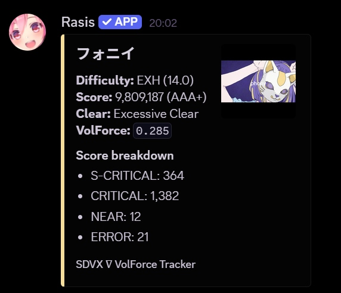
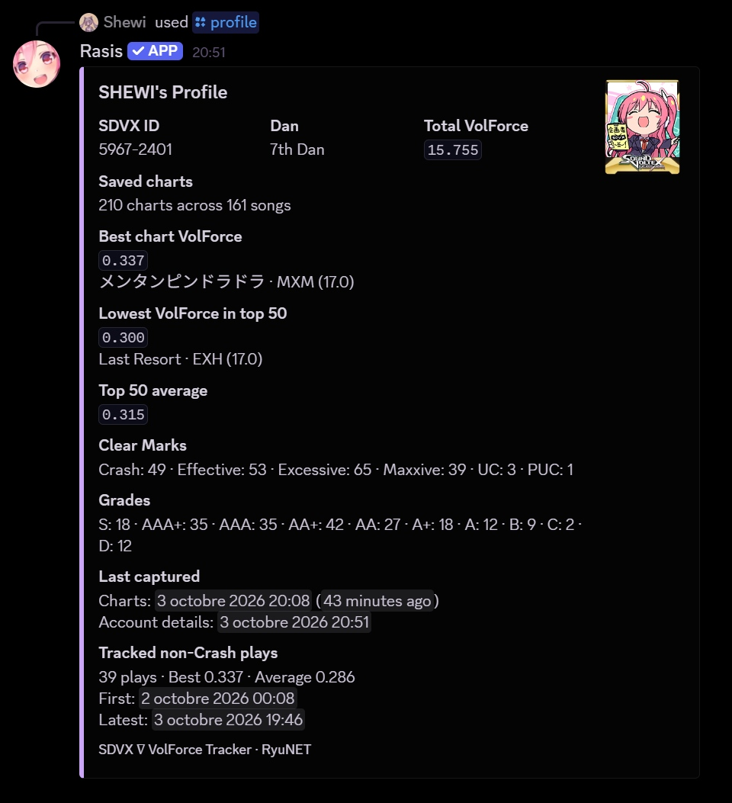
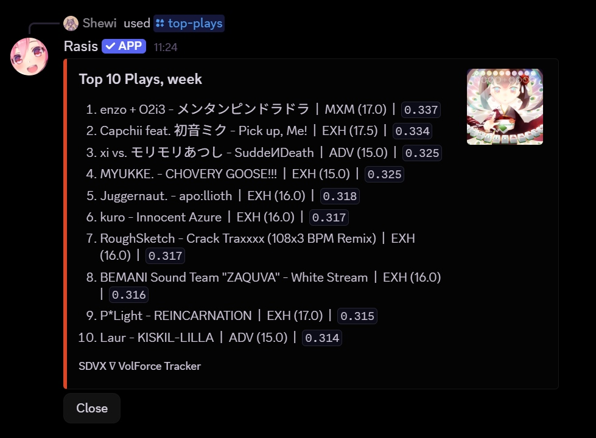
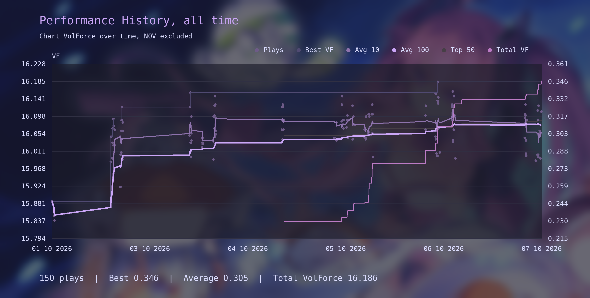

# SDVX ∇ VolForce Tracker

Very random script to track, send, and generate stats of plays in real time, for SOUND VOLTEX ∇, running on the RyuNET private network.  
They are sent in Discord DMs via a local bot.

The script observes the game's e-amusement result requests through a local proxy and forwards them unchanged to Ryu's server.

[Custom charts](https://x.ryu7w7.xyz/plugin/sdvx@asphyxia/custom%20charts%20setup) are supported.

<p>
	
</p>
<p>
	
</p>
<p>
	
</p>
<p>
	
</p>

## Setup

- Clone the repo and move it to sdvx' root folder
- Install Node.js.
- Clone Ryu's [RyuNET-core](https://github.com/Ryu7w7/RyuNET-core) repo, then move `RyuNET-core-master` next to `ea_proxy.ts`. Your game's folder should look like this:

```text
SOUND VOLTEX NABLA/
...
|-- SDVX7-VolForce-Tracker-main/
	|-- assets/
	|-- proxy/
	|-- RyuNET-core-master/
	|-- tracker/
	|-- .env
	|-- .gitignore
	|-- bot.py
	...
```

- Install the RyuNET-core Node.js dependencies once, so the local proxy can reuse its protocol decoders:

```powershell
cd C:\Path\To\RyuNET-core-master
npm install
```

- Set Spice2x's EA Service URL to `http://127.0.0.1:8080/service`.
- Create a Discord app
- Install the needed Python requirements, use a venv as needed:

```bash
pip install -r requirements.txt
```

- Create and fill a .env from the template.
- Edit `config.py` to customize the username, paths, and performance graph.
- Run `run_tracker.bat`, _then_ start the game. Create a shortcut of it for easy access !

> [!NOTE]  
> If you use a virtual environment, replace the Python launcher line. Replace `venv` with whatever the name of your venv is.
>
> ```bat
> start "SDVX Discord Bot" /D "%REPO_ROOT%" "%ComSpec%" /k "%REPO_ROOT%venv\Scripts\python.exe" "%REPO_ROOT%bot.py"
> ```

## Limitations

- You cannot run the game without the proxy, as long as EA Service URL is set to localhost.
- Due to API limitations, the message is sent only after quitting the result page.
- Timing is estimated from the midpoints of the following 7 values histogram the game sends to the server, found in `soundvoltex.dll`. It does not match in-game's CRITICAL or NEAR judgements for some reasons:

|        | Window      | Midpoint |
| ------ | ----------- | -------- |
| h3     | ± 16.67 ms  | 0 ms     |
| h2, h4 | ± 33.33 ms  | ±25 ms   |
| h1, h5 | ± 41.67 ms  | ±37.5 ms |
| h0, h6 | ± 133.33 ms | ±87.5 ms |

Let $\forall i \in [1, 5] \cap \mathbb{Z}$ $h_i$ the number of notes in its respective hit window.

Thus:

$Timing = \frac{87.5(h_6-h_0) + 37.5(h_5-h_1) + 25(h_4-h_2)}{\displaystyle\sum_{i=0}^{6} h_i}$ ms.

## Credits

- The local proxy reuses the e-amusement decoding utilities from [RyuNET-core](https://github.com/Ryu7w7/RyuNET-core).
