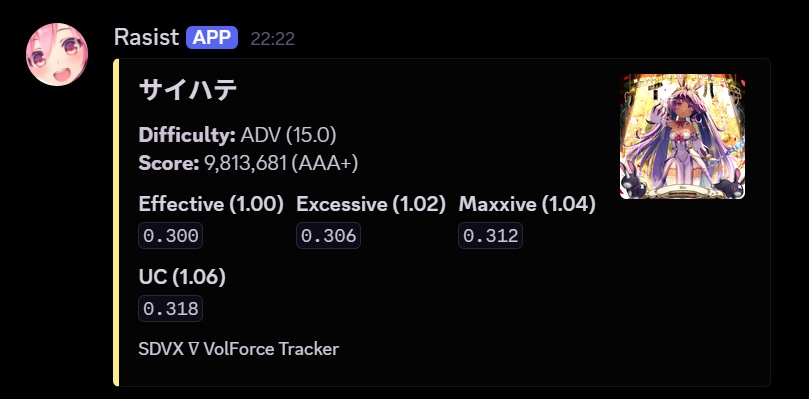

# SDVX ∇ VolForce Tracker

Very random script to send results after a play in DMs for SOUND VOLTEX ∇, version `KFC-2026082500` only.

The main point of it is to be able to fast check VF after each play.

The script reads data directly from the memory allocated in the heap by the game for the score, thus `SCORE_WRITE_OFFSET` and `DIFF_INDEX_OFFSET` has to be changed after each update. See `score_hook.cpp` for more details.



## Setup

- Clone the repo and move it to sdvx' root folder
- Compile the C++ code

```cpp
g++ -O2 -shared -o score_hook.dll score_hook.cpp -static
```

- Move the DLL to the game's root folder, and add it to the Inject DLL Hooks list from `spicecfg.exe`
- Create a Discord app
- Create a .env file based on the template and fill the needed fields (Imgur is optional)
- Install the needed Python requirements, use a venv as needed:

```bash
pip install -r requirements.txt
```

- Run the bot (create a .bat for easy access)

```bash
python bot.py
```

## Credits

- A part of the code is from Ryu's [SDVX-Discord-Rich-Presence](https://github.com/Ryu7w7/SDVX-Discord-Rich-Presence/blob/main/main.cpp), in particular the stdout parsing.

- `sdvx_rpc.py` file in JoFoxTheCat's [SDVX ∇ Launcher](https://github.com/JofoxTheCat/SDVX7-Launcher) has been used to find memory address of current song's difficulty.

## Limitation
I have not been able to find memory address of the clear type yet, so every clear type is listed, except Crash, and PUC when it's not the case.